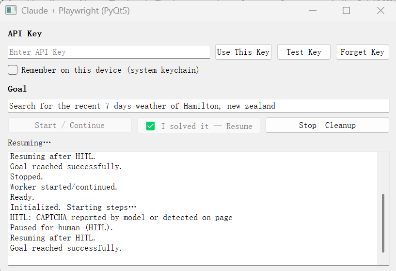
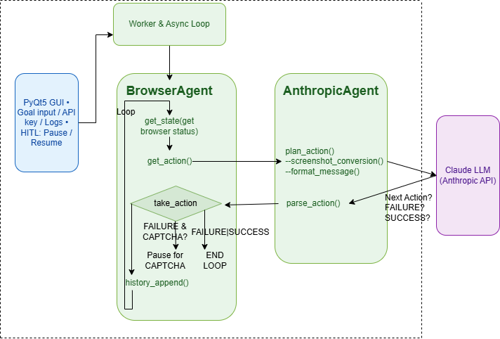

# BrowserAgent + Anthropic Planner + GUI(PyQt5)


### Update on Sep 15,2025

A minimal, production‑lean browser automation agent that uses **Playwright** to control the browser and an **Anthropic Claude planner** to decide actions. It ships with an optional **Desktop-style UI(PyQT5)** that shows live steps and gracefully pauses for **CAPTCHA / human verification** (HITL), then resumes when you press **Continue/Enter**.

> **Design goal:** keep your original `browser.py`, `anthropicAgent.py`, and `gui_main.py` untouched (or with the smallest possible tweaks). The UI integrates through lightweight callbacks.

---

## ✨ Features

- **BrowserAgent core** (Playwright): navigation, typing, clicking, scrolling, tab tracking, screenshots.
- **Anthropic action planner**: uses Claude 3.5 Sonnet `computer-use-2024-10-22` beta tool schema.
- **HITL/CAPTCHA pause**: detection is **URL-based only** (no deep iframe probes) to avoid site breakage; UI displays the page and pauses your run until you confirm.
- **Streamlit UI** (optional): chat‑style step feed + latest screenshot, “Continue after CAPTCHA”, start/stop, headless toggle.
- **Token & latency aware**: UI doesn’t add verbose context—planner calls remain as lean as your core code.
- **Integration test**: `mytest.py` launches a real Chromium session and runs an end‑to‑end goal.


## 🗂 Project layout

```
.
├─ browser.py                # BrowserAgent and related dataclasses/enums
├─ anthropicAgent.py         # Anthropic-based planner (Claude 3.5 Sonnet, beta tool-use)
├─ gui_main.py                 # Minimal integration test entrypoint
├─ utils.py                 # Utility functions for the GUI
├─ human_pause.py                 # Human pause handler for the GUI
├─ #streamlit_app.py          # (Optional) Chat-style UI with HITL pause & resume
├─ deploy_architecture.png   # High-level deployment diagram
└─ monitor_architecture.png  # Monitoring / HITL flow diagram
```

If you don’t see `streamlit_app.py` yet, copy the one from the documentation or from your previous message into the repo root.


## 🧰 Requirements

- Python **3.10+**
- Chromium via Playwright
- Python packages:
  - `playwright`
  - `anthropic`
  - `pillow`
  - `PyQT5` (GUI)

Install:

```bash
pip install -U playwright anthropic pillow streamlit
# Linux users may also need:
# playwright install-deps
playwright install chromium
```

> **Windows note:** If you hit `ModuleNotFoundError: PIL`, `pip install pillow` again in the active venv.


## 🔑 Configuration

`anthropicAgent.py` reads the API key from the environment variable **`apikey`**:

```bash
# PowerShell
$env:apikey="sk-ant-..."

# bash/zsh
export apikey="sk-ant-..."
```

Planner defaults (model/flags) are set **inside** `anthropicAgent.py`:
- `model="claude-3-5-sonnet-20241022"`
- `beta_flag=["computer-use-2024-10-22"]`

Adjust inside that file if you need a different model/version.


## 🚀 Quickstart

### 1) Run the integration test (no UI)

```bash
export apikey="sk-ant-..."         # or set in PowerShell
python mytest.py
```

This launches Chromium and executes the default goal (e.g., “give me the wikipedia page of MCP”).


### 2) Run with Streamlit UI (optional)

The UI provides:
- Start/Stop controls
- Headless toggle
- Max steps / step delay / max tokens
- Live step feed and **latest screenshot**
- **“I’ve solved the CAPTCHA — continue”** button (and an Enter‑to‑continue input)

Run:

```bash
export apikey="sk-ant-..."         # or set in PowerShell
streamlit run streamlit_app.py
```

In the left sidebar:
1. Paste your Anthropic API key (or just rely on `apikey` env).
2. Set an initial URL (default: `https://google.com`) and a short goal.
3. Click **Start**. If a CAPTCHA appears, solve it in the real browser window, then
   click **✅ Continue** (or press Enter in the “continue” input).


## 🧩 How the UI integrates (minimal changes)

- **No code changes** required in `browser.py` or `anthropicAgent.py`.
- The UI wires two lightweight callbacks when creating `BrowserAgent`:
  - `on_step`: to push step metadata & the latest screenshot into the chat feed.
  - `wait_for_human(reason)`: to **block** when a challenge is detected; it displays a banner and waits for your “continue” signal.
- Challenge detection remains your original **URL‑based** logic (no iframe checks).

This keeps the core agent deterministic and avoids bloating LLM prompts—**token usage stays close to running `mytest.py` directly**.


## 🖼 Architecture

### Desktop App Prototype
A simple PyQt desktop interface was built to support goal input, API key configuration, logging, and HITL pause/resume during browser automation workflows.


### Agent workflow



### Deployment


### Monitoring & HITL


## ⚙️ Configuration knobs

- **Headless**: turn **off** when you expect to solve CAPTCHAs manually.
- **`max_steps` / `wait_after_step_ms`** (via `BrowserAgentOptions`): throttle execution for stability.
- **Planner `max_tokens`**: the UI simply sets the planner instance’s attribute; no prompt bloat.


## 🧪 Tips & Troubleshooting

- **CAPTCHA / “cannot switch to a different thread”**  
  Prefer running the UI + non‑headless browser. Avoid mixing async and sync Playwright APIs in the same process.

- **High token use**  
  Keep goals short and avoid dumping previous step logs into the planner prompt. The provided UI doesn’t add extra history.

- **Playwright not found**  
  Make sure you’ve run `playwright install chromium` (and `playwright install-deps` on Linux).

- **PIL not installed**  
  `pip install pillow` in the same virtual environment.


## 🛡️ Security

- API key is read from `os.environ["apikey"]`. Don’t hardcode keys or commit them.
- Consider a `.env` loader or OS keychain if needed.
- UI does **not** persist screenshots or logs unless you add that explicitly.


## 🗺 Roadmap (nice-to-haves)

- Optional frame‑level challenge probing (behind a flag).
- Screenshot diffing to skip redundant uploads to the planner.
- Export run logs + screenshots bundle for debugging.
- Per‑site action budgets / rate limiting.


## 🤝 Contributing

1. Fork the repo
2. Create a branch: `feat/my-improvement`
3. Send a PR with a concise description and repro steps


## 📄 License

Add your chosen license (e.g., MIT) as `LICENSE` at the project root.

---

### 简要中文说明

- 这是一个基于 **Playwright** 的浏览器 Agent，使用 **Anthropic Claude** 作为动作规划器。  
- 提供可选的 **Streamlit** 聊天式 UI：遇到 **验证码** 会在界面提示并暂停，手工处理后点击“继续”即可恢复。  
- **不改动/最小改动**现有 `browser.py`、`anthropicAgent.py`、`mytest.py` 即可运行。

祝你构建顺利！
